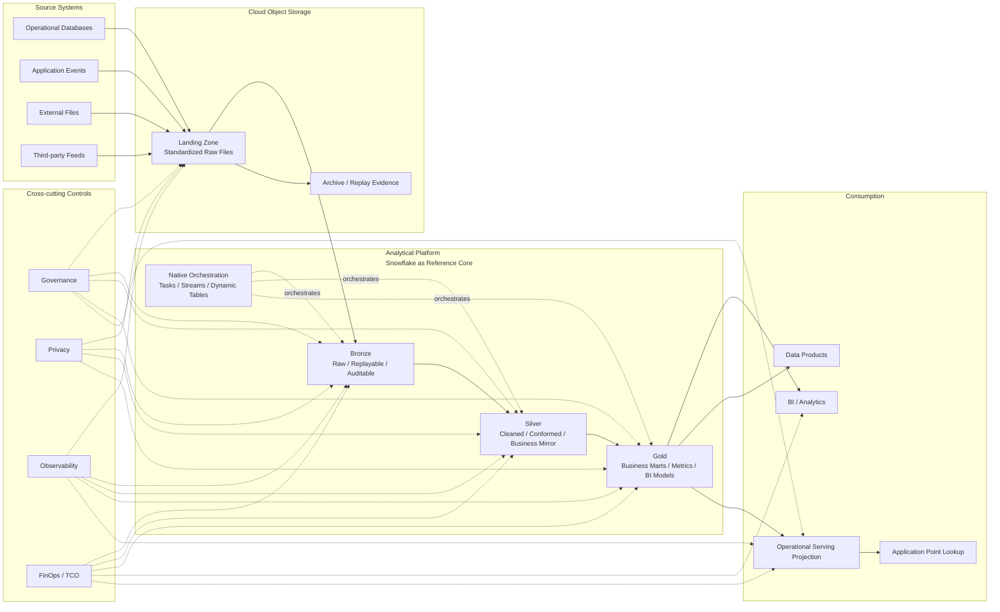

# 02 · Reference Architecture: One Clear Data Path

## 1. Purpose

This document defines a reference architecture for a low-complexity lakehouse platform.

It is not an implementation guide for a specific cloud environment, enterprise, or project. It also does not claim that Snowflake is the only correct choice for every scenario. Snowflake is used here as the reference platform: a core analytical platform that can support storage, compute, modeling, orchestration, and part of the governance surface.

The real question this document addresses is:

> How should we design a clear, governable, migratable, and TCO-explainable data path that can also support near real-time data consumption where appropriate?

My basic view is:

> A modern data platform reference architecture should first solve the problem of system boundaries. Only after it is clear where data comes from, where it lands, where it is modeled, how it is consumed, how it is governed, and how cost is attributed does the choice of specific technical components become meaningful.

This document focuses on:

* the overall main data path;
* the responsibilities of Sources, Landing, Bronze, Silver, Gold, and Consumption;
* the boundaries among analytical workloads, operational workloads, and transactional workloads;
* where near real-time fits in the architecture;
* the role of operational serving projections;
* how governance, privacy, observability, and FinOps cut across the full data path;
* the benefits, costs, and unsuitable scenarios for this architecture.

---

## 2. Architecture Overview

This reference architecture is organized around one main data path:

```text
Sources
  -> Cloud Object Storage Landing
  -> Managed Ingestion
  -> Snowflake Bronze
  -> Snowflake Silver
  -> Snowflake Gold
  -> BI / Analytics
  -> Operational Serving Projection
```

The purpose of this path is not to cover every possible data scenario. It is to provide a default explanation model for most enterprise analytical data needs.

When a data source enters the platform, when a metric is built, when a report is consumed, or when an application needs to read a derived state, the team should first try to explain it through this main path. Only when the business SLA, throughput, latency, or access pattern clearly exceeds the capability boundary of this path should additional architecture be introduced.

---

## 3. Reference Architecture Diagram



This diagram expresses four core ideas:

1. Source data first enters a unified landing layer, instead of each source system writing directly into a separate target.
2. Snowflake acts as the analytical platform center, supporting Bronze / Silver / Gold as well as the main transformation and orchestration paths.
3. BI and analytics read from Gold; application point lookups read from operational serving projections.
4. Governance, privacy, observability, and FinOps are not separate afterthoughts. They form a cross-cutting control plane across the full data path.

---

## 4. Layer Responsibilities

### 4.1 Source Systems: Owners of Transactional Truth

Source systems often include:

* operational databases;
* application events;
* external files;
* partner or third-party feeds;
* SaaS exports;
* batch data drops.

The primary responsibility of these systems is to support business transactions, application workflows, and external data exchange. They are not designed for analytical modeling.

Therefore, the first boundary in the reference architecture is:

> Source systems own the transaction source of truth. The data platform should not directly modify transactional state in business OLTP systems.

This does not mean the data platform cannot produce valuable derived outputs for business workflows. It can generate risk signals, customer states, recommendations, operational metrics, financial estimates, and other derived results. But those outputs should enter business workflows through controlled serving, API, messaging, or reverse ETL patterns, rather than by letting the data platform directly write source system tables.

### 4.2 Landing: Unified Ingestion and Decoupling Layer

In this reference architecture, Landing and Bronze are modeled as two different responsibilities: Landing is the handoff and evidence layer for source data entering the platform, while Bronze is the raw query layer after data enters the analytical platform.

In most enterprise scenarios, physically separating the two gives clearer replay, audit, governance, and cost boundaries. However, in small-scale, low-risk, or specific table-format architectures, the two responsibilities can also be implemented together.

The landing layer usually sits in cloud object storage.

Its purpose is not simply to “store another copy of the data.” It provides four types of capability:

1. **Decoupling**: source systems and the analytical platform are decoupled, so source systems do not directly depend on Snowflake internal structures.
2. **Replay**: when downstream loading or transformation fails, raw files or change records can be replayed.
3. **Audit**: the platform preserves evidence of what entered the data platform.
4. **Archive handoff**: raw data that needs long-term retention can be managed through object storage lifecycle and archive policies.

The landing layer can receive data through multiple patterns:

* change files generated from CDC;
* scheduled batch export files;
* third-party pushed files;
* application event micro-batches;
* standardized files produced by API ingestion.

The key point is not that every source must use the exact same connector. The key point is that after data enters the platform, it follows a unified file contract, path convention, metadata model, and loading pattern.

### 4.3 Managed Ingestion: Loading Landing Data into Bronze

Managed ingestion loads data from Landing into Snowflake Bronze.

In a Snowflake reference architecture, common options may include:

* Snowpipe;
* batch loading;
* CDC loaders;
* scheduled ingestion tasks;
* third-party ingestion tools.

The responsibility of this layer should remain narrow:

* load data reliably;
* record technical metadata;
* handle basic format issues;
* identify failed records;
* support replay;
* avoid complex business logic.

Complex business logic should not be placed inside ingestion adapters. Otherwise, each source system becomes a special-purpose business processor, making future maintenance and testing harder.

### 4.4 Bronze: Raw Evidence Layer

Bronze is the raw layer after data enters Snowflake.

It should stay close to source data and preserve:

* source identifier;
* source event time;
* ingestion time;
* source operation;
* source offset or file reference;
* raw payload;
* pipeline metadata.

The responsibility of Bronze is to preserve evidence, support troubleshooting, and support downstream reconstruction.

Bronze should not be responsible for:

* core business metrics;
* BI consumption;
* application point lookups;
* deep business transformation;
* user-facing semantic layers.

If Bronze directly serves large amounts of business consumption, the platform likely lacks a stable Silver / Gold semantic layer.

### 4.5 Silver: Business Mirror Layer

Silver is a critical layer in this architecture.

Its task is not merely “data cleaning.” It converts source system storage structures into relatively stable business mirrors.

This includes:

* deduplication;
* schema alignment;
* type standardization;
* entity resolution;
* unifying primary keys and business keys;
* handling SCD or historical changes where needed;
* hiding source system differences;
* applying foundational data quality rules.

I believe this is where the core value of Medallion architecture lives:

> Silver allows downstream consumers to depend on business objects instead of OLTP schemas.

This allows source systems to continue evolving for application needs, while analytical logic can continue developing on top of relatively stable business mirrors.

### 4.6 Gold: Business Consumption Layer

Gold is the data product layer for business consumption.

It supports:

* BI dashboards;
* business metrics;
* analytical marts;
* finance, operations, or product reporting;
* data products;
* source models for operational serving.

The goal of Gold is not to turn every dataset into one large wide table. The goal is to provide business-readable, semantically stable, owned, and quality-controlled data consumption objects.

Typical Gold objects include:

* fact tables;
* dimension tables;
* aggregate marts;
* semantic-ready models;
* metric-oriented tables;
* serving projection source models.

The core principle is:

> Business metrics should be defined in Gold whenever possible, instead of being scattered across BI tools, temporary SQL, and application code.

### 4.7 BI / Analytics: Analytical Consumption

BI, reporting, and ad hoc analysis should primarily read from Gold.

This has three benefits:

1. BI does not directly depend on Bronze or source system structures.
2. The same metric is not repeatedly reimplemented in multiple BI reports.
3. Data quality, access control, cost, and ownership are easier to manage.

BI tools can still define presentation-layer measures, but core metric logic should be pushed back into Snowflake Gold whenever possible.

### 4.8 Operational Serving Projection: Application Point Lookup Layer

Some data consumption is not analytical querying. It is application point lookup.

For example:

* What is the current state of a user?
* What are the current tags of an account?
* Does an object satisfy a specific operational rule?
* What is the latest derived result for a business entity?

These requests are usually key-based, low-latency, high-concurrency, and small-result-set. They are not a good fit for directly querying Snowflake Gold models.

The reference architecture therefore introduces an operational serving projection:

```text
Gold model
  -> Incremental refresh
  -> Publisher
  -> Serving store
  -> Application point lookup
```

The serving store could be a document database, key-value store, search index, cache-backed service, or an API layer owned by the application team. The specific choice depends on the business access pattern.

The key principle is:

> Operational serving is a projection published from the analytical platform. It is not a new transaction source of truth.

---

## 5. Workload Separation: Three Workload Types Must Be Separated

A low-complexity lakehouse architecture should clearly separate three types of workloads.

### 5.1 Transactional Workload

Transactional workloads belong to business OLTP systems.

They focus on:

* transactional consistency;
* user operations;
* application writes;
* business state changes;
* low-latency transactional queries.

The data platform should not directly own these transactional writes.

### 5.2 Analytical Workload

Analytical workloads belong to Snowflake or a similar analytical platform.

They focus on:

* batch scans;
* aggregation;
* historical analysis;
* dimensional modeling;
* BI;
* data quality;
* metric calculation;
* ad hoc exploration.

Snowflake is well suited for this type of workload.

### 5.3 Operational Read Workload

Operational read workloads sit between the two.

They are not transactional writes, and they are not large-scale analytical queries. They are usually application reads of a current state or derived result by key.

This type of workload is easy to misplace onto Snowflake because the data often comes from Snowflake Gold. But based on access pattern, it is closer to serving than analytics.

Therefore, the architecture should separate it out and serve it through operational serving projections.

---

## 6. Where Near Real-Time Fits

Near real-time should not be interpreted as “all data moves in real time.”

In this architecture, near real-time more accurately means:

> Using CDC, micro-batch, incremental loading, Dynamic Tables, Streams, Tasks, or similar mechanisms to refresh key business data from source changes to consumable models within minutes or small-batch intervals.

### 6.1 CDC Is Only the First Step

CDC lets the platform know what changed in source systems.

But end-to-end freshness also depends on:

* when the change is captured;
* when it is written to Landing;
* when it is loaded into Bronze;
* when Silver processes it;
* when Gold refreshes;
* when BI or serving projection becomes readable;
* when downstream applications use the new result.

So CDC is not the same as real time. CDC solves change awareness and incremental capture. It does not automatically guarantee real-time business consumption.

### 6.2 Do Not Default to Streaming-First Just Because CDC Exists

Many business scenarios only need to know what happened between two batch loading windows.

For example:

* which records were inserted;
* which records were updated;
* which records were deleted;
* which entities need recomputation;
* which aggregates need incremental refresh.

These scenarios need CDC, but they do not necessarily need a full streaming architecture.

If the business SLA is minute-level freshness, CDC + micro-batch + Snowflake-native processing may be sufficient.

### 6.3 When True Streaming Is Needed

If the business requires:

* millisecond-level response;
* event-by-event processing;
* high-throughput event streams;
* complex event windows;
* real-time risk control;
* real-time recommendation;
* transaction-level low-latency decisions;

then a dedicated streaming or event-driven architecture should be designed separately. The requirement should not be forced into the Snowflake lakehouse main path.

A mature architecture knows the boundary between near real-time and true streaming.

---

## 7. Role of Snowflake-Native Orchestration

This reference architecture leans toward Snowflake-native orchestration, but it does not exclude all external orchestration.

### 7.1 Capabilities That Fit Well Inside Snowflake

Capabilities that should often be evaluated inside Snowflake first include:

* SQL transformation;
* incremental models;
* Dynamic Tables;
* Streams;
* Tasks;
* data quality checks;
* refresh orchestration;
* preparation of serving source models;
* cost attribution based on query metadata.

The benefits are:

* more centralized runtime state;
* easier correlation between query history and task history;
* more unified access control;
* fewer moving parts;
* easier cost attribution.

### 7.2 When External Systems May Still Be Needed

External orchestration or application services still have value.

Examples include:

* third-party API orchestration;
* human approval workflows;
* application-side event processing;
* cross-system notifications;
* special connectors;
* complex event-driven workflows;
* application-owned serving APIs.

The point is not to avoid external systems entirely. The point is to avoid making external systems the default glue layer.

Every additional system should have a clear responsibility and an exit boundary.

---

## 8. Governance, Privacy, Observability, and FinOps as Cross-Cutting Layers

In the reference architecture, governance, privacy, observability, and FinOps should not be considered only in their own chapters.

They should cut across every layer.

### 8.1 Governance

Governance should answer:

* who owns each data product;
* which models are approved for BI;
* which models can be used for operational serving;
* where data quality rules are defined;
* how schema changes are managed;
* where metric definitions are maintained;
* how downstream dependencies are identified.

### 8.2 Privacy

Privacy should answer:

* where PII is identified;
* which PII can enter Landing;
* which fields need hashing, tokenization, or isolation;
* which roles can access sensitive data;
* which data can be consumed by BI or applications;
* how deletion, retention, and audit are handled.

### 8.3 Observability

Observability should answer:

* whether data arrives on time;
* which pipelines are delayed;
* which models fail quality checks;
* which serving projections have not refreshed;
* which queries are unusually expensive;
* which source systems have schema drift;
* which downstream consumers still depend on old models.

### 8.4 FinOps / TCO

FinOps should answer:

* which workload drives which cost;
* which domain or use case consumes the most;
* which BI refresh jobs are expensive;
* which near real-time models are not worth continuous refresh;
* which warehouses or compute resources have no owner;
* whether the new platform actually lowers overall TCO;
* whether legacy decommissioning has reduced real complexity.

If these questions cannot be answered, the platform may be technically running but not truly manageable.

---

## 9. Architecture Variants

This reference architecture can be adjusted based on business needs. Three common variants are below.

### 9.1 Batch-First Lakehouse

Suitable when:

* freshness requirements are hourly or daily;
* BI and reporting are the primary use cases;
* operational serving is limited;
* the team wants maximum simplicity.

Characteristics:

* ingestion is primarily batch-based;
* most Gold models are scheduled materializations;
* Dynamic Tables are used sparingly;
* complex streaming is not needed.

### 9.2 Near Real-Time Lakehouse

Suitable when:

* minute-level freshness is required;
* incremental processing matters;
* some business states need faster refresh;
* BI and operational serving both exist.

Characteristics:

* CDC or micro-batch enters Landing;
* Bronze / Silver / Gold support incremental processing;
* key models use Dynamic Tables, Streams, Tasks, or similar mechanisms where justified;
* application point lookups use serving projections.

### 9.3 Streaming-First Architecture

Suitable when:

* millisecond-level or second-level SLA is required;
* high-throughput event streams are central;
* complex event processing is needed;
* real-time risk control or recommendation is required.

Characteristics:

* the streaming platform is a first-class component;
* the lakehouse may become a downstream analytical sink;
* event schema governance, stateful processing, and exactly-once or at-least-once semantics require separate design;
* the Snowflake-centric main path should not be applied mechanically.

---

## 10. Core Trade-Offs

| Architecture Choice                       | Benefit                                                                 | Cost                                                                                                                                                |
| ----------------------------------------- | ----------------------------------------------------------------------- | --------------------------------------------------------------------------------------------------------------------------------------------------- |
| Use Snowflake as the analytical core | Reduces system assembly complexity and unifies modeling and consumption | The architecture becomes more dependent on Snowflake’s native capabilities and design boundaries; workloads outside Snowflake’s sweet spot may require companion systems or separate architecture |
| Introduce a Landing layer                 | Clearer decoupling, replay, audit, and archive handoff                  | Additional storage, metadata, and lifecycle management                                                                                              |
| Use Bronze / Silver / Gold                | Decouples source system structure from business semantics               | Requires modeling discipline and clear layer responsibilities                                                                                       |
| Prioritize Snowflake-native orchestration | Reduces external scheduling and glue code                               | Stronger dependency on Snowflake’s operating model                                                                                                  |
| Use operational serving projections       | Avoids direct application access to Snowflake                           | Adds a serving store and consistency monitoring                                                                                                     |
| Do not directly write to business OLTP    | Reduces blast radius and keeps ownership clear                          | Reverse ETL or activation requires separate design                                                                                                  |
| Do not default to true streaming          | Reduces complexity and TCO                                              | Not suitable for millisecond-level or event-by-event scenarios                                                                                      |
| Design governance and FinOps upfront      | Makes the platform more controllable and cost-explainable               | Requires continuous engineering discipline                                                                                                          |

---

## 11. Common Anti-Patterns

| Anti-Pattern                                               | Problem                                                    | Better Approach                                                   |
| ---------------------------------------------------------- | ---------------------------------------------------------- | ----------------------------------------------------------------- |
| Using a unique ingestion architecture for every source     | Long-term maintenance and troubleshooting become complex   | Use a unified Landing and ingestion pattern                       |
| Writing source system data directly into final models      | Lacks replay and audit boundaries                          | Land first, then load into Bronze                                 |
| Serving BI directly from Bronze                            | Business logic is unstable and metrics drift               | Provide consumption models through Silver / Gold                  |
| Making every Gold model near real-time                     | Continuous refresh cost may not match value                | Choose materialization based on freshness and consumption value   |
| Introducing a full streaming stack just because CDC exists | Confuses change capture with real-time consumption         | Let SLA determine whether streaming is needed                     |
| Letting applications query Snowflake for point lookups     | Cost, latency, and workload isolation become unpredictable | Use operational serving projections                               |
| Letting the data platform directly write to business OLTP  | Ownership becomes unclear and blast radius increases       | Activate through controlled reverse ETL, API, or serving patterns |
| Adding FinOps only at the end                              | Cost cannot be attributed                                  | Introduce workload ownership during architecture design           |
| Adding governance only at the end                          | PII, access, and audit debt expands                        | Design governance across ingestion, modeling, and consumption     |

---

## 12. Architecture Success Criteria

A reference architecture should not be judged only by whether it goes live.

More important criteria include:

* most data sources can reuse a unified ingestion pattern;
* source system changes do not directly break BI and business metrics;
* Bronze, Silver, and Gold have clear responsibilities;
* near real-time models have explicit freshness targets;
* scenarios that do not need true streaming are not over-engineered;
* BI consumption primarily comes from Gold;
* application point lookups do not directly access Snowflake analytical models;
* operational serving projections are rebuildable, auditable, and observable;
* PII, access, and audit boundaries are clear;
* cost can be attributed by workload and use case;
* legacy pipelines have migration and decommissioning paths;
* the team can explain the architecture without relying on a few people’s memory.

---

## 13. Closing Summary

The core of this reference architecture is not Snowflake itself. The core is a set of clear boundaries for a low-complexity lakehouse:

* source systems own transactional truth;
* Landing provides decoupling, replay, and archive handoff;
* Bronze preserves raw evidence;
* Silver builds business mirrors;
* Gold serves BI and data products;
* operational serving projections support application point lookups;
* governance, privacy, observability, and FinOps cut across the full path.

Snowflake is used as the reference platform in this playbook because it can reduce analytical platform assembly complexity in many scenarios. But the real goal of platform design is not to bind the architecture to a vendor. The goal is to build a data architecture that is operable, governable, migratable, and explainable from a TCO perspective.

The following chapters expand on how to design Landing and ingestion patterns, how to use Medallion modeling to manage semantic evolution, how to move governance and privacy upfront, how to
