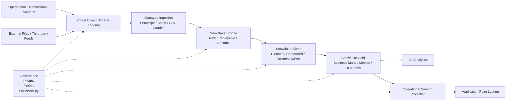

# Designing a Snowflake-Based Lakehouse Architecture

> A Low-Complexity Lakehouse Playbook for Near Real-Time Data Consumption

## 0. Foreword

This playbook is not a Snowflake product introduction, nor is it a sanitized version of an internal project document.

It is a personal architecture reflection on how to design a modern lakehouse platform based on Snowflake, especially when the goal is to support minute-level near real-time data consumption while reducing system complexity, controlling total cost of ownership, and keeping governance boundaries clear.

My central view is:

> A good lakehouse architecture should not chase the largest number of tools, nor should it blindly chase the lowest possible latency. What matters is finding an operating balance among sufficient data freshness, system complexity, governance, team capability, and total cost of ownership.

Snowflake is not the only answer, and it is not automatically the right answer for every data problem. It is an architectural choice. When a team wants to consolidate analytical storage, compute, modeling, orchestration, and part of the governance surface into a smaller number of systems, Snowflake can be a strong candidate for the core platform.

But this does not mean every problem should be pushed into Snowflake. Snowflake is well suited to be the center of an analytical data platform. It should not be misused as a high-concurrency OLTP API, nor should it replace every streaming, transactional serving, or application backend capability.

---

## 1. What Problem This Playbook Tries to Solve

Many enterprise data platforms do not start out complex. They become complex gradually through years of incremental decisions.

Common symptoms include:

* more and more data sources, each with its own ingestion pattern;
* CDC, files, APIs, manual exports, and third-party data feeds mixed together;
* data processing logic scattered across databases, scripts, BI tools, schedulers, and application code;
* reports and metrics depending on individual knowledge rather than governed data products;
* BI queries, ad hoc analysis, and application point lookups competing for the same compute layer;
* cloud cost only becoming visible at the end of the month, with limited attribution to domains, models, or business use cases;
* legacy platforms remaining in place after a new platform is introduced, creating permanent dual-run complexity;
* data governance, PII protection, auditability, and access control being added after the platform is already live.

The common root cause is often not that a single tool is too weak. It is that system boundaries are unclear.

Therefore, this playbook is not about adding more tools. It is about using fewer and clearer system boundaries to support the core requirements of a modern data platform.

---

## 2. Overall Design Approach

I tend to design this type of platform around one clear data path:

```text
Operational / Transactional Sources
  -> Cloud Object Storage Landing
  -> Managed Ingestion
  -> Snowflake Bronze
  -> Snowflake Silver
  -> Snowflake Gold
  -> BI / Analytics
  -> Operational Serving Projection
```

The design thinking behind this path is:

1. **Source systems still own transactional truth.** Business OLTP systems remain the transaction source of truth.
2. **The landing layer provides decoupling.** It supports ingestion, replay, audit, and archive handoff.
3. **Bronze preserves raw evidence.** It stays close to source data and avoids complex business logic.
4. **Silver builds the business mirror.** It converts OLTP storage structures into more stable and understandable business objects.
5. **Gold serves business consumption.** It supports BI, analytics, metrics, reporting, and downstream data products.
6. **Operational serving is a projection.** Application point lookups read from a serving projection, not directly from Snowflake.
7. **Governance, privacy, FinOps, and observability cut across the entire path.** They are part of the platform design, not after-the-fact add-ons.

---

## 3. Reference Architecture



This diagram is not intended to describe any specific company implementation. It describes a general architecture pattern:

* analytical data processing is consolidated around Snowflake as much as appropriate;
* source ingestion first lands in a governed object storage layer;
* modeling follows Bronze / Silver / Gold responsibilities;
* application point lookups are served through an operational projection;
* governance, security, cost management, and observability are designed across the full lifecycle.

---

## 4. Design Principles

### 4.1 Reduce Complexity First

Data platform complexity usually comes from too many system boundaries, not from one component alone.

If a problem can be solved reliably with Snowflake-native capabilities, I would not start by introducing another scheduler, streaming platform, serving layer, or custom script. Every additional system adds another set of permissions, monitoring, deployment processes, alerts, failure modes, and required team skills.

Reducing complexity is not about using fewer tools for its own sake. It is about building a platform that can be operated sustainably.

### 4.2 Snowflake Is an Analytical Center, Not a Universal Backend

Snowflake is well suited to act as the center of an analytical data platform. Storage, transformation, modeling, data quality, BI serving, and part of orchestration can be designed around it.

However, Snowflake should not be treated as a high-concurrency application point-lookup API, nor should it take responsibility for transactional writes into business OLTP systems. Mixing analytical workloads and operational workloads usually creates problems in cost, latency, and ownership boundaries.

### 4.3 Near Real-Time Is Not the Same as True Streaming

CDC can capture changes, but capturing changes does not mean the business already has real-time data.

From the moment a change happens to the moment it becomes consumable, the chain may include:

* change capture;
* ingestion;
* landing;
* loading;
* transformation;
* quality checks;
* serving model refresh;
* downstream consumption.

Any one of these steps can define the actual end-to-end freshness.

Therefore, CDC is not the same as real time. Capturing changes is only the first step in a near real-time or real-time data path.

The core value of CDC is that it lets the platform understand what happened between two batch loads or two ingestion runs. It solves change awareness and incremental capture. It does not automatically solve end-to-end real-time consumption.

In other words, sometimes the business only needs to know which inserts, updates, and deletes happened between batch loading windows, so that downstream jobs can perform incremental loading, reconciliation, compensation, or recomputation. That requirement does need CDC, but it does not necessarily require a full real-time streaming architecture around CDC.

In this playbook, near real-time generally means minute-level or small-batch incremental refresh. It is useful for operational metrics, BI acceleration, customer states, risk signals, business tags, and data product synchronization. It does not mean millisecond-level streaming, real-time matching, real-time risk control, or high-frequency event processing.

Not every scenario needs true streaming. If the business target is minute-level freshness, or simply capturing changes between batch loads, introducing a full Kafka / Flink / self-managed streaming stack may add significant complexity without proportional benefit.

### 4.4 The Essence of Medallion Is Decoupling Two Types of Data Work

Bronze / Silver / Gold is not just a naming convention.

I prefer to understand Medallion architecture as a way to decouple two different types of data operations.

The first type of operation converts OLTP storage structures into relatively stable business mirrors.

OLTP tables are often designed for transactional writes, application queries, and implementation efficiency. They may change because of application refactoring, field extensions, performance optimization, or vendor changes. A data platform should not force every downstream metric and report to directly depend on these structures.

The second type of operation extracts useful information from the business mirror.

This includes metric definitions, dimensional modeling, analytical views, reporting models, data products, and operational projections.

Once these two operations are decoupled, OLTP systems can evolve, business logic can be upgraded, the data path becomes cleaner, and governance and testing become easier to manage.

### 4.5 The Data Platform Should Not Directly Write to Business OLTP

A data platform can produce valuable derived outputs, such as customer tags, risk signals, recommendations, commission estimates, or operational statuses.

But there are many possible reverse ETL or operational activation patterns for bringing those outputs back into business workflows:

* write to a serving store;
* write back through an API owned by the application team;
* notify business systems through a message queue;
* synchronize through a dedicated reverse ETL tool;
* let business systems read a published projection from the data platform.

This playbook leans toward the serving projection pattern, but that is only one possible solution. The core principle is not that a specific database must be used. The principle is that the data platform should not directly pollute the transactional source of truth owned by business OLTP systems.

Business systems continue to own transactional state. The data platform publishes operational projections that are rebuildable, auditable, and versioned.

### 4.6 TCO Matters More Than Individual Tool Cost

Technology selection discussions often focus on isolated costs: whether a warehouse is expensive, or how much a specific service costs per month.

But the real cost of a data platform is total cost of ownership:

* number of tools;
* system integration;
* orchestration complexity;
* monitoring and alerting;
* incident response;
* data consistency issues;
* required team skills;
* migration cost;
* security and audit cost;
* long-term maintenance cost.

Choosing Snowflake as the core platform may concentrate some spending in the Snowflake bill. But if it reduces the need for multiple peripheral systems, schedulers, custom scripts, and cross-system troubleshooting, the overall TCO may be lower.

This is why cost governance should not only look at the bill. It should look at workload attribution, platform complexity, and the operating model.

---

## 5. Suitable Scenarios

This architecture is more suitable when:

* the organization wants Snowflake to be the primary analytical data platform;
* data sources include database CDC, batch files, third-party data feeds, and exports from business systems;
* the business needs minute-level freshness rather than millisecond-level response;
* the team wants to reduce scattered orchestration across Airflow, Lambda, Step Functions, or custom scripts;
* BI, reporting, analytics, and some operational point lookups need a common data foundation;
* data governance, privacy protection, auditability, and cost attribution are design requirements;
* the current legacy data platform is too complex and needs gradual consolidation;
* the team wants fewer system boundaries while keeping the platform sustainable to operate.

---

## 6. Scenarios Where This Architecture Needs Caution

This architecture should not be interpreted as the standard answer to every data problem.

Use caution when the requirement involves:

* millisecond-level event processing;
* high-frequency trading or real-time matching;
* hard real-time risk control;
* extremely high-throughput event streams;
* complex event processing;
* large-scale online feature serving;
* low-latency model inference;
* strong multi-region active-active requirements;
* strict preference for open-source portability;
* the data platform itself performing application transactional writes.

If the business SLA requires sub-second processing or event-by-event processing, a dedicated streaming or event-driven architecture should be designed separately. Not every problem should be forced into the Snowflake lakehouse path.

---

## 7. Playbook Structure

This playbook is organized as a set of Markdown documents:

```text
snowflake-lakehouse-playbook/
  README.md
  01-design-goals.md
  02-reference-architecture.md
  03-ingestion-and-landing.md
  04-data-modeling.md
  05-governance-and-privacy.md
  06-finops-and-tco.md
  07-operational-serving.md
  08-migration-playbook.md
  09-decision-rationale.md
```

### 01-design-goals.md

Explains why system complexity is a central problem in modern data platforms, including how data pipelines, orchestration, governance, permissions, auditability, and cost attribution can amplify each other, and why a Snowflake-centric lakehouse can be one way to reduce that complexity.

### 02-reference-architecture.md

Defines the main architecture path: Sources → Landing → Bronze → Silver → Gold → Consumption. It also discusses the boundary between analytical workloads and operational workloads.

### 03-ingestion-and-landing.md

Explains the value of a unified landing layer, including replay, audit, archive handoff, schema drift, dead-letter handling, and the boundary of near real-time ingestion.

### 04-data-modeling.md

Explains the responsibilities of Bronze / Silver / Gold, and how Medallion architecture decouples OLTP structure changes from business logic evolution.

### 05-governance-and-privacy.md

Discusses PII, RBAC, least privilege, minimal use of secure views, auditability, and the principle that the data platform should not directly write to business OLTP systems.

### 06-finops-and-tco.md

Discusses Snowflake cost attribution, warehouse strategy, query tagging, resource monitors, materialization discipline, and why TCO matters more than individual tool cost.

### 07-operational-serving.md

Explains why applications should not directly query Snowflake for point lookups, and how operational serving projections can support low-latency reads.

### 08-migration-playbook.md

Explains how to migrate from a legacy data platform to a new lakehouse using dual-run, parity checks, cutover, shadow mode, and decommissioning.

### 09-decision-rationale.md

Collects the key architecture trade-offs: why not every scenario needs streaming, why Snowflake should not be used as an OLTP API, why the landing layer is valuable, and why FinOps and governance must be designed upfront.

---

## 8. Public Information and Writing Boundaries

This playbook is based only on public information, general architecture practices, and abstracted personal thinking.

It does not include:

* any internal company system;
* any real project detail;
* any real cost number;
* any real cloud account, bucket, role, warehouse, or network configuration;
* any internal security policy or audit script;
* any non-public business data or migration state.

All examples are neutral and conceptual. They are used to explain system design ideas, not to describe any specific organization’s implementation.

---

## 9. Core Trade-Offs

The core trade-offs of this architecture can be summarized as follows:

| Design Choice                            | What It Provides                                                               | What It Costs                                                      |
| ---------------------------------------- | ------------------------------------------------------------------------------ | ------------------------------------------------------------------ |
| Using Snowflake as the analytical center | Reduced cross-system complexity, unified modeling and consumption              | Higher platform concentration; requires cost and access governance |
| Using a landing layer                    | Clearer decoupling, replay, audit, and archive handoff                         | Additional storage and metadata management                         |
| Using Medallion layers                   | Decouples OLTP structure from business logic                                   | More modeling workflow; requires clear layer responsibilities      |
| Using Snowflake-native orchestration     | Less external scheduling and cross-system debugging                            | Stronger dependency on Snowflake’s operating model                 |
| Using operational serving projections    | Avoids direct application access to Snowflake and protects workload boundaries | Adds a serving store and requires consistency monitoring           |
| Not directly writing to business OLTP    | Reduces blast radius and keeps system ownership clear                          | Reverse ETL requires a separate activation pattern                 |
| Emphasizing FinOps and TCO               | Cost becomes attributable and understandable to management                     | Requires engineering discipline and continuous operation           |
| Not defaulting to true streaming         | Reduces system complexity                                                      | Not suitable for millisecond-level use cases                       |

---

## 10. Final Summary

My basic view on this type of platform is:

> The key to a near real-time lakehouse is not making all data real-time, nor connecting every possible tool. The key is finding a balance among the freshness the business actually needs, the complexity the team can operate, the governance boundaries the organization can trust, and the TCO that management can understand.

Snowflake can be the core platform in this architecture, but only if the designer is clear about what it is good at and what it should not be used for.

It is well suited to carry the main analytical data path, unify modeling and BI consumption, reduce external orchestration complexity, and support some minute-level near real-time data products.

But it should not be treated as a replacement for every data system. Application point lookups, transactional writes, millisecond-level event processing, complex streaming, and online inference should be evaluated based on their own business SLAs.

The goal of this playbook is to make these judgments explicit and reusable, so they can be discussed, challenged, and improved.
