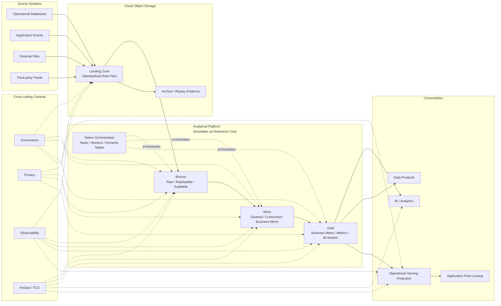

# 02 · 参考架构：一条清晰的数据主链路

## 1. 文档目的

这篇文档定义一套低复杂度 lakehouse 架构的参考设计。

它不是某个云环境、某个企业或某个项目的实施方案，也不试图证明 Snowflake 是所有场景下唯一正确的选择。Snowflake 在这里被用作 reference platform：一个可以承载分析型存储、计算、建模、调度和部分治理能力的核心平台。

这篇文档真正关注的是：

> 如何设计一条清晰、可治理、可迁移、可解释 TCO 的数据主链路，并在这个主链路中合理支持 near real-time 数据消费。

我的基本判断是：

> 现代数据平台的参考架构应该首先解决系统边界问题。只有当数据从哪里来、在哪里落地、在哪里建模、如何消费、如何治理、如何归因成本这些边界清楚之后，具体技术组件的选择才有意义。

因此，这篇文档会重点讨论：

* 整体主链路；
* 数据源、Landing、Bronze、Silver、Gold、Consumption 的职责；
* analytical workload、operational workload 和 transactional workload 的边界；
* near real-time 在这个架构中的位置；
* operational serving projection 的作用；
* 治理、隐私、可观测性和 FinOps 如何横向贯穿全链路；
* 这套架构的优点、代价和不适用场景。

---

## 2. 架构总览

这套参考架构围绕一条主链路展开：

```text
Sources
  -> Cloud Object Storage Landing
  -> Managed Ingestion
  -> Snowflake Bronze
  -> Snowflake Silver
  -> Snowflake Gold
  -> BI / Analytics
  -> Operational Serving Projection
```

这条链路的目标不是覆盖所有可能的数据场景，而是为大多数企业分析型数据需求提供一个默认解释框架。

如果一个数据源进入平台、一个指标被构建、一个报表被消费、一个应用需要读取派生状态，团队都可以先尝试用这条主链路来解释。只有当业务 SLA、吞吐、延迟或使用模式明确超出这条链路的能力边界时，才需要引入额外架构。

---

## 3. 参考架构图



这张图表达四个核心观点：

1. 数据源先进入统一的 Landing，而不是每个源系统直接写入独立目标。
2. Snowflake 作为分析型平台中心，承载 Bronze / Silver / Gold 以及主要转换和调度。
3. BI 和分析读取 Gold；应用点查读取 operational serving projection。
4. 治理、隐私、可观测性和 FinOps 不是单独模块，而是横跨全链路的控制面。

---

## 4. 架构分层职责

### 4.1 Source Systems：交易事实的拥有者

源系统通常包括：

* operational databases；
* application events；
* external files；
* partner or third-party feeds；
* SaaS exports；
* batch data drops。

这些系统的主要职责是服务业务交易、应用流程和外部数据交换。它们不是为分析建模而设计的。

因此，参考架构中的第一个边界是：

> 源系统拥有 transaction source of truth，数据平台不应该直接改变业务 OLTP 的交易状态。

这并不意味着数据平台不能产生对业务有价值的派生结果。它可以生成风险标签、客户状态、推荐结果、运营指标、财务预估等。但这些结果应该通过受控的 serving、API、消息或 reverse ETL 模式进入业务流程，而不是让数据平台直接写源系统表。

### 4.2 Landing：统一接入和解耦层

在这套 reference architecture 中，Landing 和 Bronze 被建模为两个不同职责：Landing 是源数据进入平台的交接与证据层，Bronze 是进入分析平台后的 raw query layer。

多数企业级场景下，两者物理分离会带来更清晰的 replay、audit、governance 和 cost boundary；但在小规模、低风险或特定 table-format 架构中，两者也可以合并实现。

Landing 层通常位于 cloud object storage 中。

它的作用不是简单“多存一份文件”，而是提供四类能力：

1. **Decoupling**：源系统和分析平台解耦，避免源系统直接依赖 Snowflake 内部结构。
2. **Replay**：当下游加载或转换出错时，可以基于原始文件或变化记录重放。
3. **Audit**：保留数据进入平台时的原始证据。
4. **Archive handoff**：将需要长期保留的原始数据交给对象存储生命周期和归档策略处理。

Landing 层可以接收多种模式的数据：

* CDC 生成的变化文件；
* 定时批量导出文件；
* 第三方推送文件；
* 应用事件微批；
* API 拉取后的标准化文件。

关键不是每种源都用完全相同的 connector，而是进入平台后形成统一的文件契约、路径规则、元数据和加载模式。

### 4.3 Managed Ingestion：把 Landing 中的数据加载到 Bronze

Managed ingestion 负责把 Landing 中的数据加载到 Snowflake Bronze。

在 Snowflake reference architecture 中，常见方式可能包括：

* Snowpipe；
* batch loading；
* CDC loader；
* scheduled ingestion task；
* third-party ingestion tool。

这层的职责应该保持克制：

* 可靠加载；
* 记录技术元数据；
* 处理基本格式问题；
* 识别失败记录；
* 支持 replay；
* 不承载复杂业务逻辑。

复杂业务逻辑不应该写在 ingestion adapter 中。否则每个源系统都会变成一个特殊业务处理器，后续维护和测试都会变困难。

### 4.4 Bronze：原始证据层

Bronze 是进入 Snowflake 后的 raw layer。

它应该尽量贴近源系统，保留：

* source identifier；
* source event time；
* ingestion time；
* source operation；
* source offset or file reference；
* raw payload；
* pipeline metadata。

Bronze 的职责是保留证据、支持排障和支持后续重建。

Bronze 不应该承担：

* 核心业务指标；
* BI 消费；
* 应用点查；
* 深度业务转换；
* 用户语义层。

如果 Bronze 直接服务大量业务消费，说明平台缺少稳定的 Silver / Gold 语义层。

### 4.5 Silver：业务镜像层

Silver 是这套架构中非常关键的一层。

它的任务不是简单“清洗数据”，而是把源系统的存储结构转换成相对稳定的业务镜像。

这包括：

* 去重；
* schema 对齐；
* 类型标准化；
* entity resolution；
* 主键和业务键统一；
* SCD 或历史变化处理；
* 源系统差异屏蔽；
* 基础数据质量规则。

我认为 Medallion 架构的核心价值就在这里：

> Silver 让下游不再直接依赖 OLTP schema，而是依赖业务对象。

这样，源系统可以为了应用需求继续演进，而分析逻辑可以基于相对稳定的业务镜像继续发展。

### 4.6 Gold：业务消费层

Gold 是面向消费的数据产品层。

它应该服务：

* BI dashboards；
* business metrics；
* analytical marts；
* finance / operations / product reporting；
* data products；
* operational serving source models。

Gold 的目标不是把所有数据做成一个大宽表，而是提供业务可理解、口径稳定、有 owner、有质量控制的数据消费对象。

典型 Gold 对象包括：

* fact tables；
* dimension tables；
* aggregate marts；
* semantic-ready models；
* metric-oriented tables；
* serving projection source models。

核心原则是：

> 业务指标应该尽量在 Gold 层统一定义，而不是散落在 BI 工具、临时 SQL 和应用代码中。

### 4.7 BI / Analytics：分析型消费

BI、报表和 ad hoc 分析应该优先读取 Gold。

这有三个好处：

1. 避免 BI 直接依赖 Bronze 或源系统结构；
2. 避免同一个指标在多个 BI 报表中重复实现；
3. 让数据质量、权限、成本和 owner 更容易管理。

BI 工具可以定义展示层 measure，但核心指标逻辑应尽量回到 Snowflake Gold 中。

### 4.8 Operational Serving Projection：应用点查层

有些数据消费不是分析型查询，而是应用点查。

例如：

* 某个用户当前状态是什么；
* 某个账户当前标签是什么；
* 某个对象是否满足一个运营规则；
* 某个业务实体的最新派生结果是什么。

这些请求通常是 key-based、低延迟、高并发、小结果集。它们不适合直接打到 Snowflake Gold 模型上。

参考架构中建议增加 operational serving projection：

```text
Gold model
  -> Incremental refresh
  -> Publisher
  -> Serving store
  -> Application point lookup
```

这里的 serving store 可以是 document database、key-value store、search index、cache-backed service 或应用团队拥有的 API 层。具体选择取决于业务模式。

关键原则是：

> Operational serving 是从分析平台发布出来的 projection，不是新的 transaction source of truth。

---

## 5. Workload Separation：三类工作负载要分开

一套低复杂度 lakehouse 架构必须清楚区分三类工作负载。

### 5.1 Transactional Workload

Transactional workload 属于业务 OLTP 系统。

它关注：

* 事务一致性；
* 用户操作；
* 应用写入；
* 业务状态变化；
* 低延迟事务查询。

数据平台不应该直接拥有这些交易写入。

### 5.2 Analytical Workload

Analytical workload 属于 Snowflake 或同类分析平台。

它关注：

* 批量扫描；
* 聚合；
* 历史分析；
* 维度建模；
* BI；
* 数据质量；
* 指标计算；
* ad hoc exploration。

Snowflake 非常适合承载这类工作负载。

### 5.3 Operational Read Workload

Operational read workload 介于两者之间。

它不是交易写入，也不是大规模分析查询。它通常是应用根据 key 读取某个当前状态或派生结果。

这类 workload 最容易被误放到 Snowflake 上，因为数据确实来自 Snowflake Gold。但从访问模式看，它更像 serving，而不是 analytics。

因此，架构上应该把它拆出来，用 operational serving projection 承接。

---

## 6. Near Real-Time 在架构中的位置

Near real-time 不应该被理解成“所有数据都实时流动”。

在这套架构里，near real-time 更准确的含义是：

> 通过 CDC、micro-batch、incremental loading、Dynamic Tables、Streams、Tasks 或类似机制，让关键业务数据在分钟级或小批量间隔内完成从源变化到可消费模型的刷新。

### 6.1 CDC 只是第一步

CDC 让平台知道源系统中发生了哪些变化。

但端到端 freshness 还取决于：

* 变化什么时候被捕获；
* 什么时候写入 Landing；
* 什么时候加载到 Bronze；
* Silver 什么时候处理；
* Gold 什么时候刷新；
* BI 或 serving projection 什么时候可读；
* 下游应用什么时候使用新结果。

所以 CDC 不等于 real time。CDC 解决 change awareness 和 incremental capture，不能自动保证业务端实时消费。

### 6.2 不要因为 CDC 就默认 streaming-first

很多业务场景只是需要知道两次 batch loading 之间发生了什么。

例如：

* 哪些记录新增了；
* 哪些记录更新了；
* 哪些记录删除了；
* 哪些实体需要重新计算；
* 哪些聚合需要增量刷新。

这类场景需要 CDC，但不一定需要完整 streaming 架构。

如果业务 SLA 是分钟级 freshness，那么 CDC + micro-batch + Snowflake-native processing 可能已经足够。

### 6.3 什么时候需要真正 streaming

如果业务要求：

* 毫秒级响应；
* event-by-event processing；
* 高吞吐事件流；
* 复杂事件窗口；
* 实时风控；
* 实时推荐；
* 交易级低延迟决策；

那么应该单独设计 streaming / event-driven architecture，而不是强行把需求塞进 Snowflake lakehouse 主链路。

架构成熟的表现，是知道 near real-time 和 true streaming 的边界。

---

## 7. Snowflake-Native Orchestration 的位置

这套参考架构倾向于优先使用 Snowflake-native orchestration，但不是排除所有外部调度。

### 7.1 适合放在 Snowflake 内的能力

适合优先放在 Snowflake 内的能力包括：

* SQL transformation；
* incremental models；
* Dynamic Tables；
* Streams；
* Tasks；
* data quality checks；
* refresh orchestration；
* serving source model preparation；
* cost attribution based on query metadata。

这样做的好处是：

* 运行状态更集中；
* 查询和任务历史更容易关联；
* 权限模型更统一；
* fewer moving parts；
* 更容易归因成本。

### 7.2 仍然可能需要外部系统的场景

外部调度或应用服务仍然有存在价值。

例如：

* 第三方 API 编排；
* 人工审批流程；
* 应用侧事件处理；
* 跨系统通知；
* 特殊 connector；
* 复杂 event-driven workflow；
* application-owned serving API。

关键不是不用外部系统，而是不要让外部系统成为默认 glue layer。

每个额外系统都应该有明确职责和退出边界。

---

## 8. 治理、隐私、可观测性和 FinOps 横切层

参考架构中，治理、隐私、可观测性和 FinOps 不应该被视为独立章节才考虑的问题。

它们应该横向贯穿每一层。

### 8.1 Governance

治理需要回答：

* 每个数据产品的 owner 是谁；
* 哪些模型可供 BI 使用；
* 哪些模型可供 operational serving；
* 数据质量规则在哪里定义；
* schema 变化如何管理；
* 指标口径在哪里维护；
* 下游依赖如何识别。

### 8.2 Privacy

隐私需要回答：

* PII 在哪里被识别；
* 哪些 PII 可以进入 Landing；
* 哪些字段需要 hash、tokenize 或隔离；
* 哪些角色可以访问敏感数据；
* 哪些数据可以被 BI 或应用消费；
* 删除、保留和审计如何处理。

### 8.3 Observability

可观测性需要回答：

* 数据是否按时到达；
* 哪些 pipeline 延迟；
* 哪些模型质量失败；
* 哪些 serving projection 未刷新；
* 哪些查询异常昂贵；
* 哪些源系统 schema drift；
* 哪些下游消费仍然依赖旧模型。

### 8.4 FinOps / TCO

FinOps 需要回答：

* 成本来自哪个 workload；
* 哪个 domain 或 use case 消耗最多；
* 哪些 BI refresh 成本高；
* 哪些 near real-time 模型不值得持续刷新；
* 哪些 warehouse 或 compute 资源没有 owner；
* 新平台是否真的降低了整体 TCO；
* legacy decommission 是否带来实际复杂度下降。

如果这些问题不能回答，平台即使技术上可运行，也不一定可管理。

---

## 9. 架构变体

这套 reference architecture 可以根据业务需求调整。常见变体包括三类。

### 9.1 Batch-first Lakehouse

适合：

* 数据新鲜度要求按小时或按天；
* BI 和报表为主；
* operational serving 很少；
* 团队希望最大化简单性。

特点：

* ingestion 以 batch 为主；
* Gold 多数使用定时物化；
* 很少使用 Dynamic Tables；
* 不需要复杂 streaming。

### 9.2 Near Real-Time Lakehouse

适合：

* 分钟级 freshness；
* 增量处理；
* 部分业务状态需要较快刷新；
* BI 和 operational serving 同时存在。

特点：

* CDC 或 micro-batch 进入 Landing；
* Bronze / Silver / Gold 支持增量处理；
* 对关键模型使用 Dynamic Tables、Streams、Tasks 或类似机制；
* 对应用点查使用 serving projection。

### 9.3 Streaming-first Architecture

适合：

* 毫秒级或秒级 SLA；
* 高吞吐事件流；
* complex event processing；
* 实时风控或实时推荐。

特点：

* streaming platform 是一等组件；
* lakehouse 可能是下游 analytical sink；
* 需要单独治理事件 schema、stateful processing、exactly-once 或 at-least-once 语义；
* 不应该简单套用 Snowflake-centric 主链路。

---

## 10. 核心 trade-off

| 架构选择                              | 好处                              | 代价                                                      |
| --------------------------------- | ------------------------------- | ------------------------------------------------------- |
| 使用 Snowflake 作为分析核心               | 减少系统拼装，统一建模和消费                  | 可扩展性更依赖 Snowflake 本身对不同场景的能力支持；对 Snowflake 不擅长的场景需要额外架构 |
| 引入 Landing 层                      | 解耦、回放、审计、归档更清晰                  | 多一层存储、元数据和生命周期管理                                        |
| 使用 Bronze / Silver / Gold         | 解耦源系统结构和业务语义                    | 需要建模纪律和层级职责                                             |
| 优先 Snowflake-native orchestration | 减少外部调度和 glue code               | 对 Snowflake 运行模型依赖更强                                    |
| 使用 operational serving projection | 避免应用直连 Snowflake                | 增加 serving store 和一致性监控                                 |
| 不直接写业务 OLTP                       | 降低 blast radius，保持 ownership 清晰 | reverse ETL 或 activation 需要单独设计                         |
| 不默认 true streaming                | 降低复杂度和 TCO                      | 不适合毫秒级或 event-by-event 场景                               |
| 治理和 FinOps 前置                     | 平台更可控、成本更可解释                    | 需要持续工程纪律                                                |

---

## 11. 常见反模式

| 反模式                           | 问题                    | 更好的做法                                   |
| ----------------------------- | --------------------- | --------------------------------------- |
| 每个源系统使用独立接入架构                 | 长期维护和排障复杂             | 使用统一 Landing 和 ingestion pattern        |
| 源系统直接写入最终模型                   | 缺少 replay 和 audit 边界  | 先进入 Landing 和 Bronze                    |
| Bronze 直接服务 BI                | 业务逻辑不稳定，指标漂移          | 通过 Silver / Gold 提供消费模型                 |
| 把所有 Gold 都做成 near real-time   | 持续刷新成本高，收益不一定匹配       | 根据 freshness 和消费价值选择物化方式                |
| 因为有 CDC 就引入完整 streaming stack | 把变化捕获误解成实时消费          | 根据 SLA 判断是否需要 streaming                 |
| 应用直接查询 Snowflake 做点查          | 成本、延迟和 workload 隔离不可控 | 使用 operational serving projection       |
| 数据平台直接写业务 OLTP                | 责任边界混乱，风险半径扩大         | 通过受控 reverse ETL / API / serving 模式激活   |
| FinOps 最后才补                   | 成本无法归因                | 从架构设计阶段引入 workload ownership            |
| 治理最后才补                        | PII、权限和审计债务扩大         | 在 ingestion、modeling、consumption 各层设计治理 |

---

## 12. 架构成功标准

一套 reference architecture 是否成功，不应该只看是否上线。

更重要的判断标准包括：

* 大多数数据源都能复用统一 ingestion pattern；
* 源系统变化不会直接破坏 BI 和业务指标；
* Bronze、Silver、Gold 职责清楚；
* near real-time 模型都有明确 freshness 目标；
* 不需要 true streaming 的场景没有被过度设计；
* BI 消费主要来自 Gold；
* 应用点查不直接访问 Snowflake 分析模型；
* operational serving projection 可重建、可审计、可监控；
* PII、权限和审计边界清晰；
* 成本可以按 workload 和 use case 归因；
* legacy pipeline 有迁移和下线路径；
* 团队可以解释这套架构，而不是依赖少数人记忆。

---

## 13. 小结

这套参考架构的核心不是 Snowflake 本身，而是围绕低复杂度 lakehouse 建立一组清晰边界：

* 源系统拥有交易事实；
* Landing 负责解耦、回放和归档交接；
* Bronze 保留原始证据；
* Silver 构建业务镜像；
* Gold 服务 BI 和数据产品；
* operational serving projection 承接应用点查；
* 治理、隐私、可观测性和 FinOps 贯穿全链路。

Snowflake 是这套 playbook 中使用的 reference platform，因为它可以在很多场景下降低分析型平台的系统拼装复杂度。但平台设计的真正目标不是绑定某个 vendor，而是建立一套可运营、可治理、可迁移、TCO 可解释的数据架构。

后续章节会进一步展开：如何设计 Landing 和 ingestion pattern，如何使用 Medallion 建模管理语义演进，如何前置治理和隐私，如何通过 FinOps 管理 TCO，如何设计 operational serving，以及如何从 legacy 平台迁移并真正下线旧复杂度。
