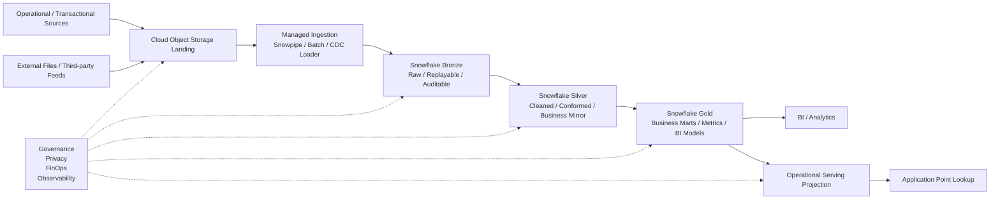

# 基于 Snowflake 的湖仓一体架构设计思考

> 面向 Near Real-Time 数据消费的低复杂度 Lakehouse Playbook

## 0. 写在前面

这份 playbook 不是一份 Snowflake 产品介绍，也不是某个内部项目的脱敏设计文档。

它是一套关于现代数据平台设计的个人思考总结：当一个组织希望构建一套基于 Snowflake 的湖仓一体平台，并且希望在支持分钟级 near real-time 数据消费的同时，尽量降低系统复杂度、控制 TCO、保持治理边界清晰时，应该如何思考整体架构、数据链路、建模方式、消费模式和迁移路径。

我的核心观点是：

> 一套好的数据湖仓一体架构，不应该追求工具数量最多，也不应该盲目追求最低延迟。真正重要的是在足够的数据新鲜度、系统复杂度、治理能力、运维能力和总拥有成本之间找到一个可长期运营的平衡点。

Snowflake 在这里不是唯一答案，也不是默认适合所有场景的答案。它是一个架构选择：当团队希望把分析型存储、计算、建模、调度和部分治理能力尽量收敛到一个平台中，减少跨系统编排和运维复杂度时，Snowflake 是一个值得认真考虑的核心平台。

但这并不意味着所有问题都应该放进 Snowflake。它适合作为分析型数据平台的中心，不应该被误用成高并发 OLTP API，也不应该替代所有 streaming、transactional serving 或 application backend 能力。

---

## 1. 这套 playbook 试图解决什么问题

很多企业的数据平台并不是一开始就复杂，而是在长期演进中逐渐变复杂。

常见问题包括：

* 数据源越来越多，每个源系统都有自己的接入方式；
* CDC、文件、API、手工导出和第三方数据 feed 混在一起；
* 数据处理逻辑散落在数据库、脚本、BI、调度器和应用代码中；
* 报表和指标口径依赖个人经验，缺少统一的数据产品层；
* BI 查询、临时分析和应用点查混用同一套计算资源；
* 成本只能在月底看账单，难以归因到领域、模型或业务场景；
* 迁移新平台时，旧平台长期保留，形成永久双运行；
* 数据治理、PII、审计和权限控制总是在上线后才被补上。

这些问题的共同根源往往不是某个工具不够强，而是系统边界不清晰。

因此，这套 playbook 的重点不是讨论“还可以增加哪些工具”，而是讨论如何通过更少、更清晰的系统边界来支撑现代数据平台的核心需求。

---

## 2. 总体设计思路

我倾向于把这类平台设计成一条清晰的主链路：

```text
Operational / Transactional Sources
  -> Cloud Object Storage Landing
  -> Managed Ingestion
  -> Snowflake Bronze
  -> Snowflake Silver
  -> Snowflake Gold
  -> BI / Analytics
  -> Operational Serving Projection
```

这条链路背后的设计思想是：

1. **源系统仍然拥有交易事实。** 业务 OLTP 系统负责 transaction source of truth。
2. **Landing 层负责解耦。** 它提供数据接入、回放、审计和归档交接能力。
3. **Bronze 保留原始证据。** 它尽量贴近源系统，不承载复杂业务逻辑。
4. **Silver 构建业务镜像。** 它把 OLTP 的存储结构转换成相对稳定、可理解的业务对象。
5. **Gold 提供业务消费。** 它面向 BI、分析、指标、报表和下游数据产品。
6. **Operational serving 是 projection。** 应用点查读取 serving projection，而不是直接打到 Snowflake。
7. **治理、隐私、FinOps 和可观测性贯穿全链路。** 这些能力不是上线后的补丁，而是平台设计的一部分。

---

## 3. 总体架构图



这张图不是为了描述某个具体公司的实现，而是表达一个通用架构模式：

* 分析型数据处理尽量收敛到 Snowflake；
* 源系统接入先进入统一 Landing；
* 数据建模通过 Bronze / Silver / Gold 分层完成；
* 应用点查通过 serving projection 承接；
* 治理、安全、成本和可观测性贯穿整个生命周期。

---

## 4. 设计原则

### 4.1 降低复杂度优先

数据平台的复杂度通常来自系统边界过多，而不是来自单个组件本身。

如果一个问题可以通过 Snowflake 原生能力稳定解决，就不应该默认引入额外的调度器、流处理平台、服务层或自定义脚本。每增加一个系统，都意味着增加一组权限、监控、部署、告警、故障排查和人员技能要求。

降低复杂度不是为了“少用工具”而少用工具，而是为了让平台能够被长期运营。

### 4.2 Snowflake 是分析中心，不是万能后端

Snowflake 适合作为分析型数据平台的中心：存储、转换、建模、数据质量、BI 服务和部分调度都可以围绕它设计。

但 Snowflake 不应该被当作应用的高并发点查 API，也不应该承担业务 OLTP 系统的事务写入责任。把 analytical workload 和 operational workload 混在一起，通常会带来成本、延迟和责任边界上的问题。

### 4.3 Near real-time 不等于 true streaming

CDC 能捕获变化，但捕获变化不等于业务已经获得实时数据。

从变化发生到业务可消费，中间至少还包括：

* change capture；
* ingestion；
* landing；
* loading；
* transformation；
* quality checks；
* serving model refresh；
* downstream consumption。

任何一个环节都可能决定最终 freshness。

因此，CDC 不等于 real time。抓到变化，只是 near real-time 或 real-time 数据链路的第一步。

CDC 的核心价值，是让平台知道两次批处理或两次加载之间到底发生了什么变化。它解决的是 change awareness 和 incremental capture 的问题，而不是自动解决端到端实时消费的问题。

换句话说，业务有时只是需要知道 batch loading 间隔内发生了哪些 insert、update、delete，并基于这些变化做增量加载、对账、补偿或重新计算。这个需求确实需要 CDC，但并不一定意味着必须为 CDC 配套建设完整的 real-time streaming 链路。

本文中的 near real-time 主要指分钟级或小批量增量刷新，适用于很多运营指标、BI 加速、客户状态、风险提示、业务标签和数据产品同步场景。它不等同于毫秒级 streaming、实时撮合、实时风控或高频事件处理。

不是所有场景都需要 true streaming。如果业务目标只是分钟级 freshness，或者只是需要捕获 batch loading 之间的变化，引入完整 Kafka / Flink / 自建 streaming stack 可能会显著增加系统复杂度，而收益并不匹配。

### 4.4 Medallion 的本质是解耦两类数据操作

Bronze / Silver / Gold 不只是分层命名。

我更愿意把 Medallion 架构理解成两类数据操作的解耦：

第一类操作，是把 OLTP 系统中的存储结构转换成相对稳定的业务镜像。

OLTP 系统的表结构通常服务于交易写入、应用查询和系统实现细节。它们可能会因为业务系统重构、字段扩展、性能优化或供应商变更而变化。数据平台不应该让所有下游指标和报表直接依赖这些结构。

第二类操作，是从业务镜像中提取有效信息。

这包括指标定义、维度建模、分析视图、报表模型、数据产品和 operational projection。

把这两类操作解耦之后，OLTP 可以变化，业务逻辑可以升级，数据链路更清晰，治理和测试也更容易管理。

### 4.5 Data platform 不应直接写业务 OLTP

数据平台可以生产有价值的派生结果，例如客户标签、风险提示、推荐结果、佣金预估、运营状态等。

但这些结果如何回到业务流程，有多种 reverse ETL 或 operational activation 模式：

* 写入一个 serving store；
* 通过应用团队拥有的 API 写回；
* 通过消息队列通知业务系统；
* 通过专门的 reverse ETL 工具同步；
* 由业务系统主动读取数据平台发布的 projection。

本文倾向于使用 serving projection 的模式，但这只是其中一种方案。核心原则不是“必须使用某个数据库”，而是：数据平台不应该直接污染业务 OLTP 的 transaction source of truth。

业务系统仍然拥有交易状态，数据平台发布的是可重建、可审计、可版本化的 operational projection。

### 4.6 TCO 比单项工具成本更重要

很多技术选型讨论容易陷入单项成本比较，例如某个 warehouse 贵不贵、某个服务每月多少钱。

但数据平台的真实成本是 TCO：

* 工具数量；
* 系统集成；
* 调度复杂度；
* 监控和告警；
* 故障排查；
* 数据一致性问题；
* 人员技能要求；
* 迁移成本；
* 安全和审计成本；
* 长期维护成本。

选择 Snowflake 作为核心平台，可能会让一部分成本集中在 Snowflake 账单上。但如果它减少了多个外围系统、调度器、自定义脚本和跨系统排障成本，那么整体 TCO 可能反而更低。

这也是为什么成本治理不能只看账单，而要看 workload attribution、platform complexity 和 operating model。

---

## 5. 适用场景

这套架构更适合以下场景：

* 组织希望 Snowflake 成为主要分析型数据平台；
* 数据源主要包括数据库 CDC、批量文件、第三方数据 feed 和业务系统导出；
* 业务需要分钟级数据新鲜度，而不是毫秒级响应；
* 团队希望减少 Airflow、Lambda、Step Functions、自定义脚本等分散编排；
* BI、报表、分析和部分运营点查需要统一数据基础；
* 数据治理、隐私保护、审计和成本归因是平台设计要求；
* 当前 legacy 数据平台复杂度较高，需要逐步收敛；
* 团队希望用更少的系统边界支撑可持续运营。

---

## 6. 不适用或需要谨慎的场景

这套架构不应该被理解成所有数据问题的标准答案。

以下场景需要谨慎：

* 毫秒级事件处理；
* 高频交易或实时撮合；
* 强实时风控；
* 超高吞吐事件流；
* 复杂事件处理；
* 大规模在线特征服务；
* 低延迟模型推理；
* 强多区域 active-active；
* 对开源可移植性有强硬要求；
* 数据平台本身需要承担应用事务写入。

如果业务 SLA 要求 sub-second processing 或 event-by-event processing，应单独设计 streaming / event-driven architecture，而不是把所有问题都纳入 Snowflake lakehouse 主链路。

---

## 7. Playbook 结构

这套 playbook 由以下文档组成：

```text
snowflake-lakehouse-playbook/
  README.zh.md
  01-design-goals.zh.md
  02-reference-architecture.zh.md
  03-ingestion-and-landing.zh.md
  04-data-modeling.zh.md
  05-governance-and-privacy.zh.md
  06-finops-and-tco.zh.md
  07-operational-serving.zh.md
  08-migration-playbook.zh.md
  09-decision-rationale.zh.md
```

### 01-design-goals.zh.md

讨论为什么系统复杂度是现代数据平台的核心问题，包括数据链路、调度、治理、权限、审计和成本归因如何相互放大复杂度，以及为什么 Snowflake-centric lakehouse 是一种降低复杂度的设计选择。

### 02-reference-architecture.zh.md

定义整体架构主链路：Sources → Landing → Bronze → Silver → Gold → Consumption，并讨论 analytical workload 和 operational workload 的边界。

### 03-ingestion-and-landing.zh.md

讨论统一 Landing 层的价值，包括 replay、audit、archive handoff、schema drift、DLQ 和 near real-time ingestion 的边界。

### 04-data-modeling.zh.md

讨论 Bronze / Silver / Gold 的职责划分，以及 Medallion 架构如何解耦 OLTP 结构变化和业务逻辑演进。

### 05-governance-and-privacy.zh.md

讨论 PII、RBAC、least privilege、Secure View 最小化、auditability 和 Zero OLTP Write 的设计原则。

### 06-finops-and-tco.zh.md

讨论 Snowflake 成本归因、warehouse 策略、Query Tag、Resource Monitor、materialization discipline，以及为什么 TCO 比单项工具成本更重要。

### 07-operational-serving.zh.md

讨论为什么应用不应该直接查询 Snowflake，以及如何通过 operational serving projection 支持低延迟点查。

### 08-migration-playbook.zh.md

讨论如何从 legacy 数据平台迁移到新的 lakehouse，包括 dual-run、parity、cutover、shadow 和 decommission。

### 09-decision-rationale.zh.md

集中讨论关键架构取舍：为什么不是所有场景都需要 streaming，为什么 Snowflake 不是 OLTP API，为什么 Landing 层值得存在，为什么 FinOps 和治理必须前置。

---

## 8. 公开信息与写作边界

这套 playbook 只基于公开信息、通用架构实践和个人抽象化思考。

它不会包含：

* 任何公司内部系统；
* 任何真实项目细节；
* 任何真实成本数字；
* 任何真实云账户、bucket、role、warehouse 或网络配置；
* 任何内部安全策略或审计脚本；
* 任何无法公开验证的业务数据或迁移状态。

文档中的示例都是中性的、概念性的，用于说明系统设计思想，而不是描述某个真实组织的实现。

---

## 9. 这套架构的核心 trade-off

这套设计的核心 trade-off 可以概括为：

| 设计选择                              | 得到什么                              | 付出什么                       |
| --------------------------------- | --------------------------------- | -------------------------- |
| 以 Snowflake 为分析中心                 | 降低跨系统复杂度，统一建模和消费                  | 平台集中度上升，需要成本和权限治理          |
| 使用 Landing 层                      | 解耦、回放、审计、归档更清晰                    | 多一层存储和元数据管理                |
| 使用 Medallion 分层                   | 解耦 OLTP 结构和业务逻辑                   | 增加建模流程，需要清楚的层级职责           |
| 使用 Snowflake-native orchestration | 减少外部调度和跨系统排障                      | 对 Snowflake 运行模型依赖更强       |
| 使用 operational serving projection | 避免应用直连 Snowflake，保护 workload 边界   | 多一层 serving store，需要一致性和监控 |
| 不直接写业务 OLTP                       | 降低 blast radius，保持系统 ownership 清晰 | reverse ETL 需要额外模式设计       |
| 强调 FinOps / TCO                   | 成本可归因，管理层可理解                      | 需要工程规范和持续运营机制              |
| 不默认 true streaming                | 降低系统复杂度                           | 对毫秒级场景不适用                  |

---

## 10. 最终总结

我对这类平台的基本判断是：

> Near real-time lakehouse 的关键，不是把所有数据都实时化，也不是把所有工具都接进来，而是在业务真正需要的数据新鲜度、团队可运营的复杂度、可治理的数据边界和可解释的 TCO 之间找到平衡。

Snowflake 可以成为这个架构中的核心平台，但前提是设计者清楚它适合什么、不适合什么。

它适合承载分析型数据平台的主链路，适合统一建模和 BI 消费，适合减少外部编排复杂度，也适合支撑一部分分钟级 near real-time 数据产品。

但它不应该被当成所有数据系统的替代品。应用点查、事务写入、毫秒级事件处理、复杂 streaming 和在线推理，都需要根据业务 SLA 单独判断。

这套 playbook 的目标，就是把这些判断系统化，形成一套可以复用、可以讨论、也可以被挑战的架构思考框架。
